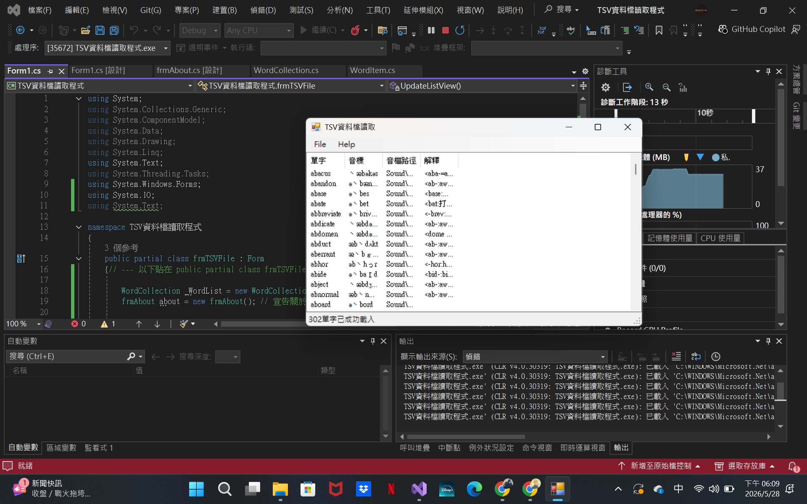

# 📖 TSV 字彙資料解析器 (TSV Vocabulary Parser)

> **課程名稱**：視窗程式設計 (II) - 資料檔讀取與自訂類別集合[cite: 3]
> **專案目標**：實作一個能動態讀取 TSV (Tab-Separated Values) 格式文字檔的桌面應用程式，並透過自訂物件集合來管理與呈現資料[cite: 3]。

---

## 🎯 系統重點功能 (Key Features)

### 1. 📂 檔案讀取與解析
* **圖形化開啟檔案**：透過 `OpenFileDialog` 讓使用者選擇系統內的資料檔，並自動過濾 `.tsv` 與 `.txt` 結尾的檔案[cite: 3]。
* **編碼支援**：採用 `Encoding.UTF8` 讀取外部資料，完美支援各國語言與特殊音標符號顯示[cite: 3]。

### 2. 🧩 物件導向資料結構
* **自訂資料實體 (`WordItem`)**：將單行字串透過 `Split('\t')` 動態切割，並將資料封裝為「單字 (Word)」、「音標 (Phonogram)」、「音檔路徑 (SoundPath)」與「解釋 (Explain)」四個屬性[cite: 3]。
* **強型別集合 (`WordCollection`)**：繼承自原生的 `Collection<WordItem>`，集中管理所有單字資料，取代傳統的複雜陣列操作[cite: 3]。

### 3. 📊 介面佈局與資料呈現
* **選單列 (`MenuStrip`)**：包含「File」與「Help」兩大功能區塊，支援檔案開啟、程式離開，以及獨立的「關於 (About)」對話方塊 (`frmAbout`)[cite: 3]。
* **清單呈現 (`ListView`)**：以 `Details` (詳細資料) 模式呈現，並動態綁定自訂的資料表頭，將記憶體中的集合資料視覺化[cite: 3]。
* **狀態監控 (`StatusStrip`)**：視窗底層設置狀態列，即時顯示目前的系統提示（如：「請開啟檔案」或「成功載入的單字數量」）[cite: 3]。

### 4. 🛡️ 防呆與安全機制
* **離開確認**：實作 `FormClosing` 視窗關閉事件。當使用者點擊右上角「X」或選單的「Exit」時，皆會觸發 `MessageBox` 進行二次確認，防止意外關閉導致進度遺失[cite: 3]。

---

## 📁 專案架構說明
* `frmTSVFile.cs`：主視窗程式碼，負責處理 UI 事件與資料綁定[cite: 3]。
* `frmAbout.cs`：軟體資訊與版權宣告的獨立對話方塊[cite: 3]。
* `WordItem.cs`：單字資料實體的類別定義[cite: 3]。
* `WordCollection.cs`：繼承自泛型集合的自訂管理類別[cite: 3]。

---

## 💻 執行畫面
*(請將您的程式執行畫面截圖命名為 screenshot.png 並放置於專案根目錄)*

---

**⚠️ 執行注意事項**：
請確保欲讀取的來源文字檔（如：`WordCards.txt`）已設定為「UTF-8 (Unicode)」編碼，否則部分音標可能會出現亂碼[cite: 3]。